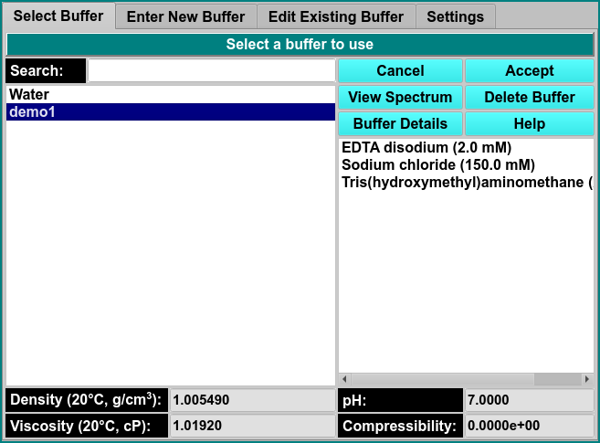
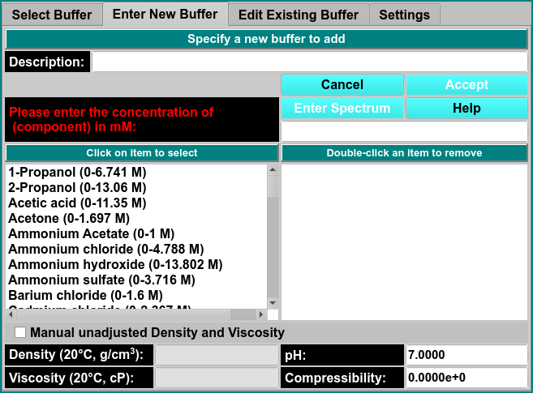
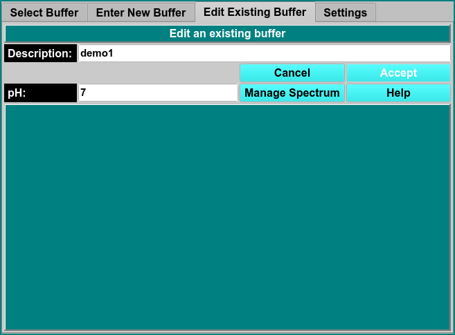
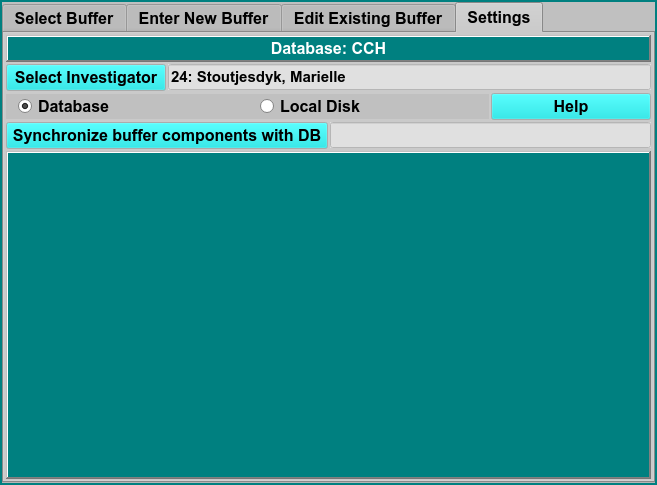

# Manage Buffers
 
MS: &#x2717;
 
BD: &#x2717;

# Select Buffer

!!! danger ""

    
    
View Spectrum

Buffer Details Clicking here will open a text file with bufer details.
   
# Enter New Buffer

!!! danger ""

    
    
Description

Concentration of (component) in mM

Manual unadjusted Density and Viscocity

View Spectrum
    
# Edit Existing Buffer

!!! danger ""

    
    
Decription

pH
    
# Settings

!!! danger ""

    
    
Select Investigator

Synchronize buffer components with DB
    