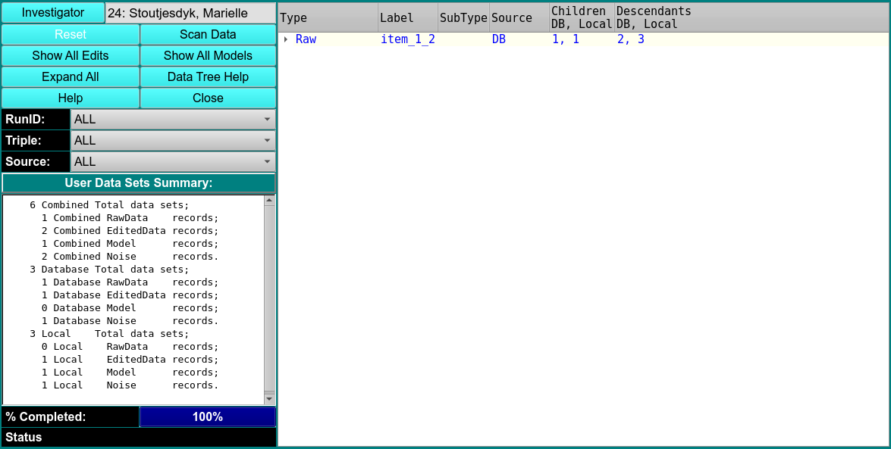

# Manage UltraScan DB/Local Data Sets

This module is used to display the four main types of data that may exist for the user in the database and/or on a local disk. They are:

1. raw experimental data;

2. edited experimental data;

3. models, and;

4. noise.

This model also provides a simple means of performing processing on data: 

1. upload to DB;

2. download to local disk, and;

3. remove from DB or local.

The primary end of any processing of the data is to achieve a synchronizing of data in the database and on the local disk. It can be desirable to insure that any new data produced has a presence on a local disk for off-network work and in the database for normal day-to-day processing.

!!! danger ""

    {width="800"}
    
Master Password Your master password must be entered to gain access to the database.

Scan Data Click this button to initiate a full scan of your data in the database and on the local disk. You can re-initiate a scan after any series of processes on the data.

Show All Edits Expand the tree view to ensure all rows at the level of Edited Data are revealed. 

Show All Models Expand the tree view to ensure all rows at the level of Model are revealed. 

