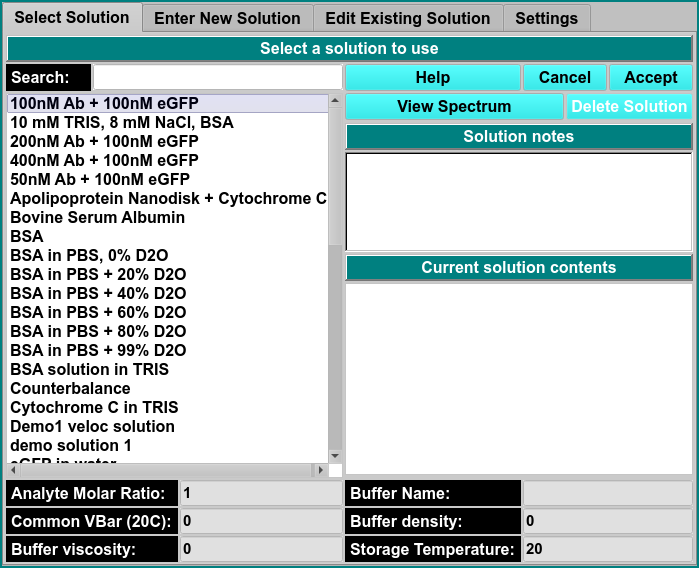
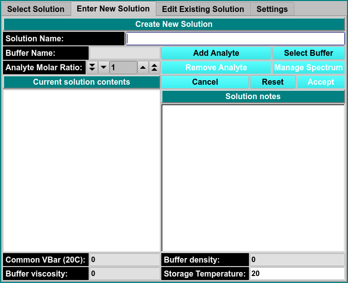
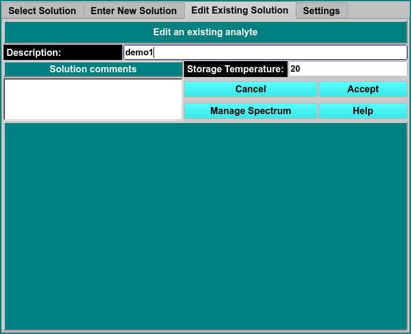
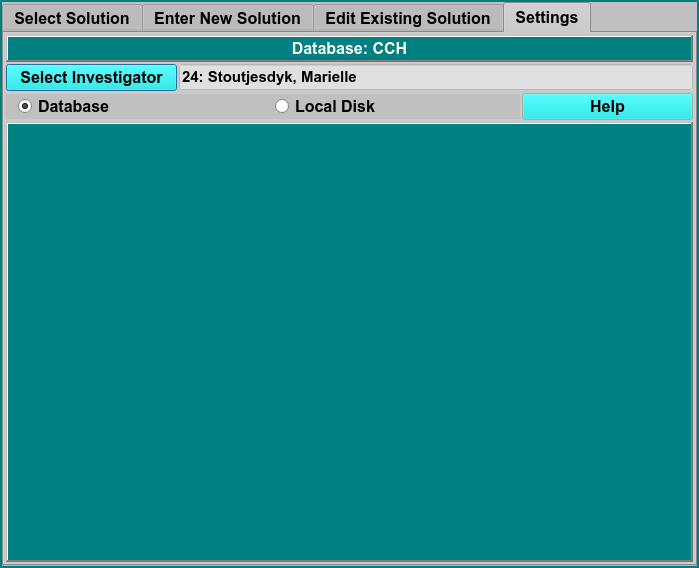

# Manage Solutions
 
MS: &#x2717;
 
BD: &#x2717;

Here you can manage solution information. You must be identified as the investigator to delete or update a solution description in the database.

# Select Solution

!!! danger ""

    {width="800"}
    
Search

View Spectrum

Solution Notes

Current Solution Contents
    
Analyte Molar Ratio
        
Common Vbar (20C)  
    
Buffer Name

Buffer Density

Storage Temperature

    
# Enter New Solution

!!! danger ""
    
    {width="800"}
    
Solution Name Enter the name of the solution.

Buffer Name Enter the name of the buffer.
     
Analyte Molar Ratio Edit this control to indicate the relative concentration of the new component that is being added.

Add Analyte Click here to add or change a component to the current solution.
    
Select Buffer Initiates a dialog to [create or select an existing buffer](database-buffer) to the current solution definition in the DB or local disk.

Common Vbar (20C)

Viscosity
    
Buffer Density

Storage Temperature

!!! danger ""
    
    {width="800"}
    
Description
    
Solution Comments

Storage Temperature

Managge Spectrum

    
# Settings

!!! danger ""

    
    
Select Investigator
    

