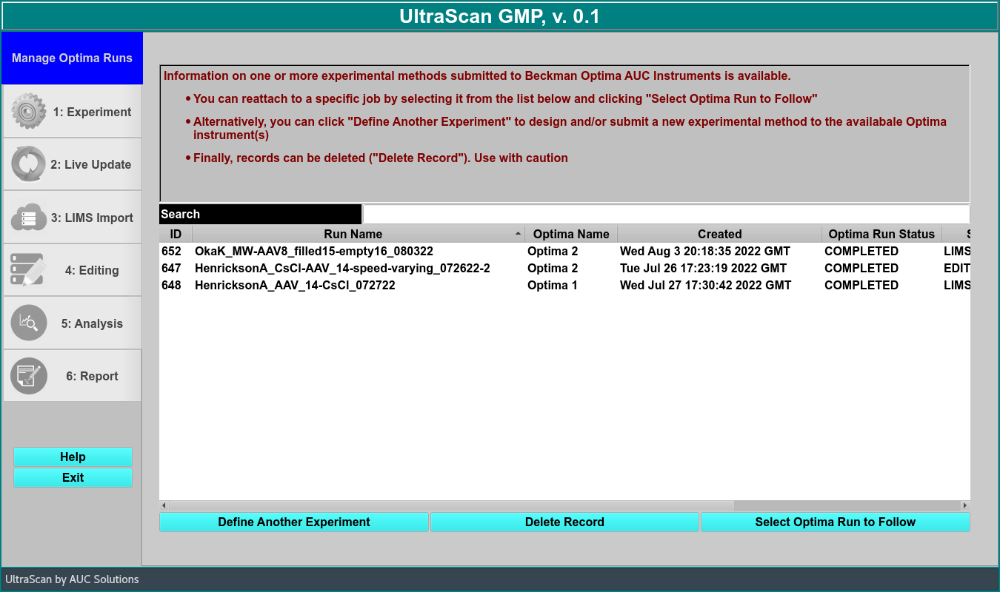
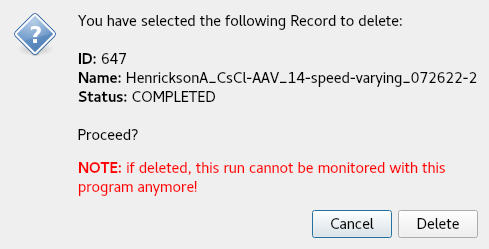

# GMP Program Overview

The UltraScan GMP, v. 0.1 program is the first of its kind. It is intended to prepare the AUC to enter a GMP environment.

!!! danger ""

    

The dialog contains all run information. It records the ID number, run name, instrument name, and date of creation. It also allows you to see the Run Status and the Stage. Finally, it will let you know if the run was in accordance to GMP standards.
    
Define Another Experiment This button allows you to design and/or submit a new experimental method to the instrument(s).
    
Delete Record Use with caution. This button deletes selected records.

??? quote "Delete Record Dialog"

    !!! danger ""

        {width="textwidth"}
 
Select Optima Run to Follow Clicking here will allow you to reattch to a specific job that has been submitted to the Beckman Optima AUC instrument.
    
