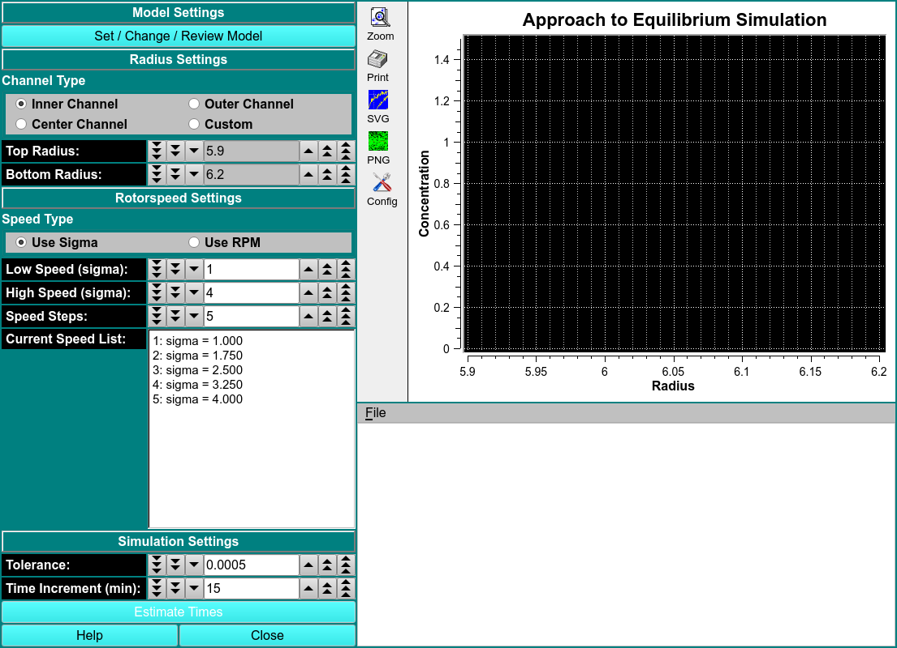

# Equilibrium Time Prediction

!!! danger ""

    
    
The time it takes for an experiment to reach its equilibrium point depends on several factors:

<b>Diffusion Coefficient</b>

<b>Sedimentation Coefficient</b>

<b>Position in Rotor</b>

<b>Column Length</b>

<b>Rotor Speed</b>

<b>Number of Components in System</b>

<b>Chemical Equilibrium</b>

How to Use:

# Model Settings

Set/Change/Review Model

# Radius Settings

Channel Type

Top Radius

Bottom Radius

# Rotor Speed Settings

Use Sigma

Use RPM

Low Speed (sigma)

High Speed (sigma

Speed Stops

Current Speed List

# Simulation Settings

Tolerance

Time Increment (min)

Estimate Times