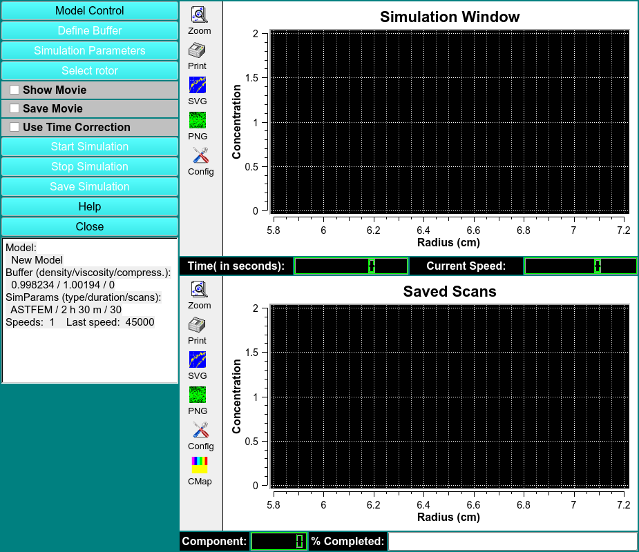

# Finite Element Simulations 

MS: &#x2717; 
  
BD: &#x2717; 

When simulating data, prior knowledge of simulation paramaters are necessary in order to generate the data. Thereby a good metric is obtained to judge to quality of the results by comparing the obtained values to the actual values that describe the solute under investigation.

One metric that is convienet to find is the solute's molar mass, $M$:

$$
M = \frac{sRT}{D(1-\bar\nu\rho)}.
$$

In this expression, we have the sedimentation and diffusion coefficients of the solute. These are the primary signals that are obtained in a SV-AUC experiment Furthermore, since the partial specific volume is given, the molar mass will represent the quality of the information retrieved. 

A second parameter to consider is the frictional ratio, $f/f_{0}$, which expresses the property of anisotropy. Note that the frictional ratio is not a true hydrodynamic parameter, but is rather a representation of the globularity of a molecule. The equation for the frictional ratio is:

$$
\frac{f}{f_{0}} = \frac{RT}{ND}\left[ 6\pi\eta\left(\frac{3M\bar\nu}{4\pi N}\right)^{1/3}\right],
$$

which has a dependence on molar mass, $M$, the diffusion coefficient, $D$, and partial specific volume, $\bar\nu$.

The final parameter of interest is each solute's partial concentration. 

!!! danger ""

    