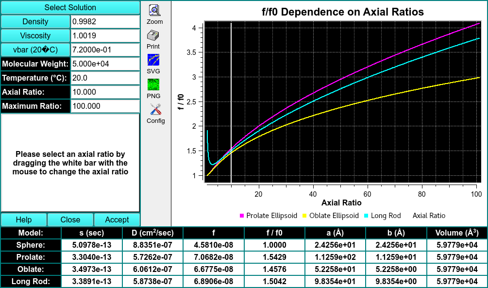

# Model s, D, and F from MW for 4 Basic Shapes

MS: &#x2717;
 
BD: &#x2717;

!!! danger ""

    
    
    f/f0 Dependance on Axial Ratios. f/f0 vs. Axial Ratio
    
Select Solution

Density

Viscosity

Vbar (20C)

Molecular Weight

Temperature

Axial Ratio

Maximum Ratio