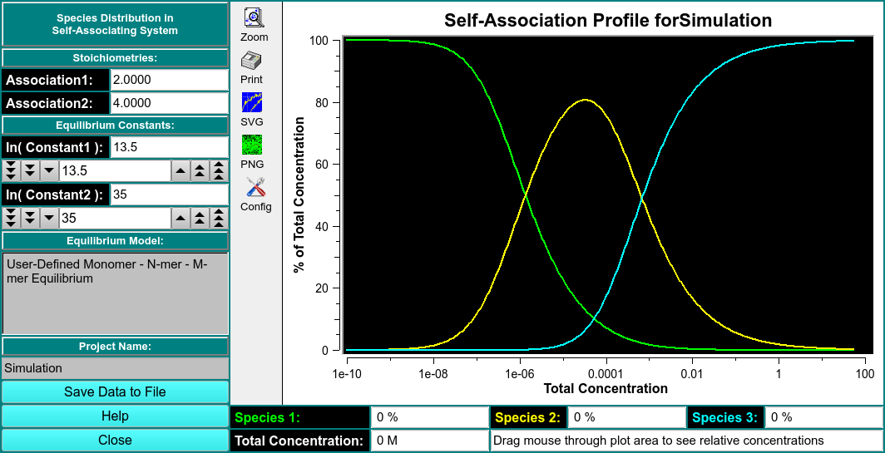

# Self Association Equilibrium

!!! danger ""

    
    
    Self-Association Profile for Simulation: % of Total Concentration vs. Total Concentration
    
Species Distribution in Self-Associating System

Stoichiometries

Equilibrium Constants 

Equilibrium Model

Save Data to File

