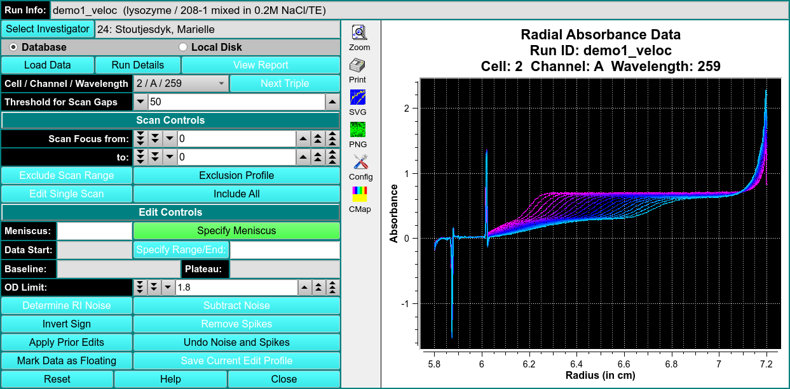
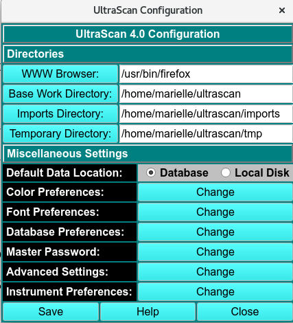

# Edit Data

!!! danger ""

    {width="textwidth"}

Run Info

Select Investigator

Load Data

Run Details

View Report

Scan Controls

Exclusion Profile

Edit Single Scan

Edit Controls

Specify Meniscus

Specify Range End

Determine RI Noise

Invert Sign

Apply Prior Edits

Mark Data as Floating

Subtract Noise

Remove Spikes

# Preferences

{align=right}

Directories

WWW Browser

Base Work Directory Sets up where the base directory will be.

Imports Directory Sets up where the imports directory will be.

Temporary Directory Sets up where the temp directory will be.

Miscellaneous Settings

Default Data Location Set as Database

Color Preferences

Font Preferences

Database Preferences Here you will fill out the information in the database configuration panel by transferring the information from the LIMS website. 

Master Password Change this to something you can remember!

Advanced Settings Debug Level: 0; ADvanced Level: 0; Number of Threads: 4; Noise Dialog Flag: 0.

Instrument Preferences Here you change the instrument that is set as the default.
