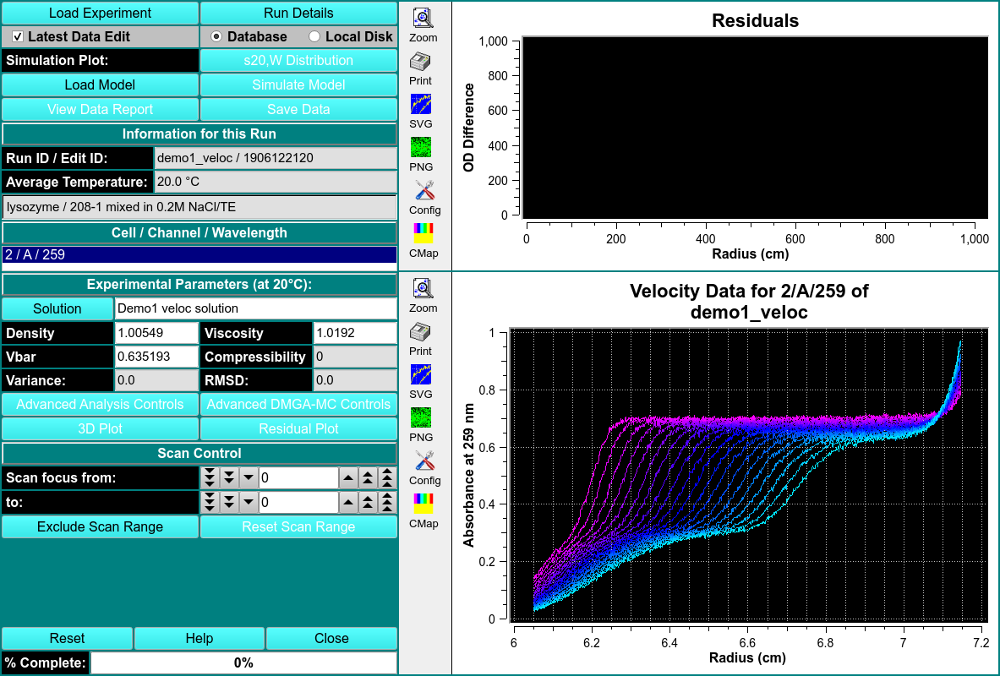
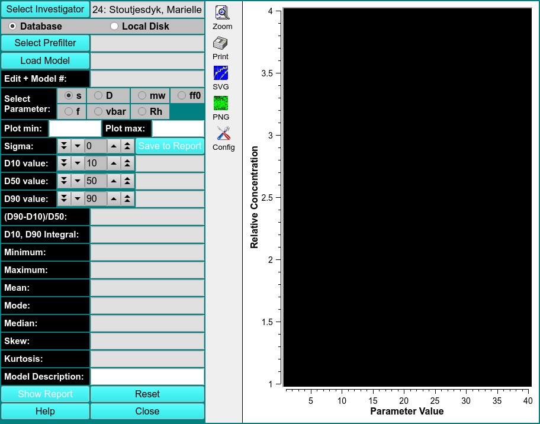

# Finite Model Model Viewer
MS: &#x2717;
 
BS: &#x2717;

This module is used to import, display, and export finite element solutions fitted to velocity experiments by various methods. The program can import models from finite element nonlinear fitting sessions, from 2-dimensional spectrum analysis fits, from genetic algorithm fits, and from C(s) fits. 

The program will then compare the fitted model to the experimental data and display residual plots, sedimentation and diffusion coefficent distributions, as well as molecular weight distributions. The model can be displayed as a 3-dimensional plot showing the partial concentrations mapped onto a 2-dimensional grid of any two of the following parameters: s, D, f, f/f0, and MW. 

Residual plots including deconvoluted time- and radially-invariant noise plots can also be displayed. The results can be saved for inclusion into a velocity result report. 

!!! danger ""

    
    
    Residuals. OD Difference vs. Radius (cm)
    
    Velocity Data. Absorbance vs. Radius (cm)

Load Model

View Data Report

s20,W Disitribution

Simulate Model

Save Data

Experimental Parameters (at 20C)

Solution

Advanced Analysis Controls

Advanced DMGA-MC Controls

3D Plot

Residuals Plot

Scan Exclusion Profile

# FE Model Statistics

This program allows you to obtain statistics for a model computed by any finite element analysis module in UltraScan. The following metrics are supported: 

1. Three distribution limits D

2. The span computed from the distribution limits 

3. The concentration integral between the lowest and highest distribution limit 

4. The minimum X-value of the distribution 

5. The maximum X-value of the distribution 

6. The mean, mode and median of the distribution 

7. The skew and kurtosis of the distribution 

!!! danger ""

    
    
    Relavant Concentration vs. Parameter Value
    
The program is started by selecting a model from the database or disk. When using the database, the investigator needs to be specified, and a prefilter can be applied. Once a model has been loaded, the user can choose the distribution based on any of the hydrodynamic parameters available in the model by checking the radio button next to the parameter. By default, the sedimentation coefficient distribution will be shown. One of the parameters fitted will be fixed and not available for plotting.

Select Prefilter

Load Model

Edit + Model #

Select Parameter

Plot Min

Plot Max

Sigma

Save to Report

D10 Value

D50 Value

D90 Value

(D90-D10)/D50

D10, D90 Integral

Minimum

Maximum

Mean

Mode

Median

Skew

Kurtosis

Model Description

Show Report