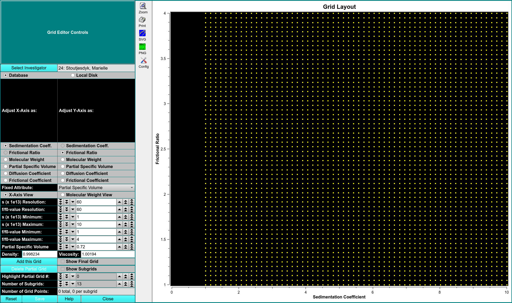

# Custom 2-D Grid Editor

MS: &#x2717;
 
BD: &#x2717;

This module allows you to edit custom 2-D initialize grids for the 2-D spectrum analysis (2DSA). Rectangular grids can be defined in both the sedimentation and molecular weight domain, as well as frictional ratio and partial specific volume domains. Each grid can be re-displayed in the other domains. It is also possible to define multiple grid regions and combine them into a single grid which defines multiple solute regions. Each partial grid can be defined with a different frictional ratio range, molecular weight, or sedimentation coefficient range. Each grid can also be defined with a different partial specific volume.

If you wish to define the grid to contain both sedimenting and floating species, you will need to define a fixed frictional ratio. However, you may have variations in the partial specific volume, to account for the difference in buoyancy while maintaining a positive molecular weight.

All combined partial grids can be saved as a special model structure that can be stored in the database or on a disk to be submitted with either the desktop or supercomputing version of the 2DSA.

!!! danger ""

    
    
Controls

Adjust X-Axis Here you can select the variable to use when adjusting the x-axis. Possible variables:

Adjust Y-Axis Here you can select the variable to use when adjusting the y-axis. Possible variables:

Fixed Attribute

X-Axis View

Molecular Weight View 

Add this Grid Click here to add the currently defined grid to the final grid to be saved. Each grid should only be added one. Each added grid constitutes a partial grid to the final grid. Should partial sub-grids overlap, duplicate solutes will be screened out before saving the overall model including each partial grid. By adding multiple grids together, it is possible to define well-degined regions as a basis for each parameter search. An error region should be defined that usually ranges from +/- 10% of the oligomeric size.

Show Final Grid This checkbox allows you to view the final grid. In this mode, it is not possible to make any further changes to the final grid or add new grids, but it is possible to change the view from sedimentation to molecular weight, or vise-versa.. It is also possible to delete partial grids. 

Show Sub-grids This checkbox allows you to view the layout of the sub-grids that will be used in the 2DSA. The 2DSA uses a scheme by which each grid is broken down into several sub-grids, each of which is analyzed independently on different processors, and the results are merged into a final grid. Each sub-grid should be small enough to fit into the computer memory of the analysis program. The sub-grid must also cover the parameter space evenly, and does not exclude major regions of the search space. 

Highlight Partial Grid Number

Number of Sub-grids

Number of Grid Points
