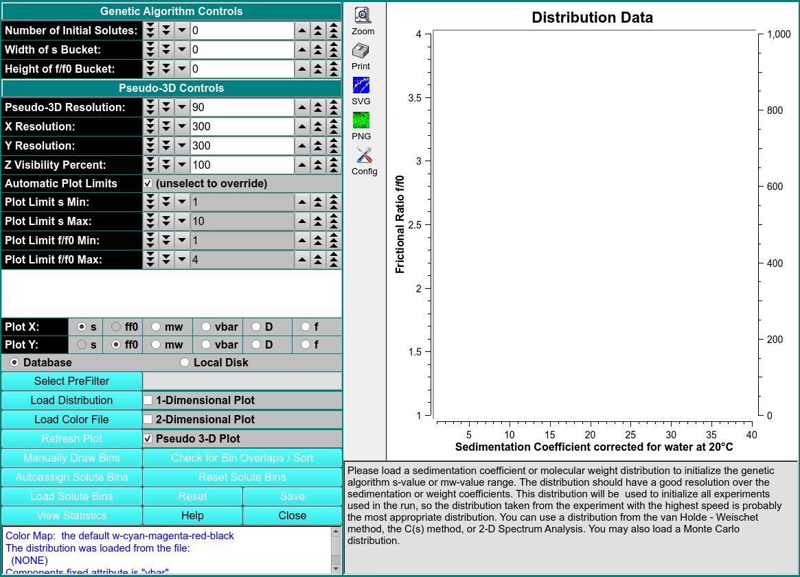

# Initialize Genetic Algorithm

MS: &#x2717;
 
BD: &#x2717;

Solute distribution data can be used to generate data for use with Genetic Algorithm analysis programs. The output data results from choosing bins (or buckets) around solute points. These buckets can be modified for better results. Once they are as desired, data for Genetic Algorithm analysis can be generated and output. 

The input data may come in one of two flavors, each of which is treated differently. The data is either SA2D type or Monte Carlo. The 2DSA is relatively sparse and generally requires fashioning buckets containing a single point. 

!!! danger ""

    
    

Genetic Algorithm Controls

Number of Initial Solutes

Weight of s Bucket

Height of f/f0 Bucket

Pseudo 3-D Controls

Pseudo 3-D Resolution

X/Y Resolution

Z Visibility Percent

Plot Limits (Max,Min)

Plot X

Plot Y

Plot Controls

Select Pre-Filter

Load Distribution

Load Color File

Manually Draw Bins

Auto-assign Solute Bins

Load Solute Bins

Check for Bin Overlaps/Sort
