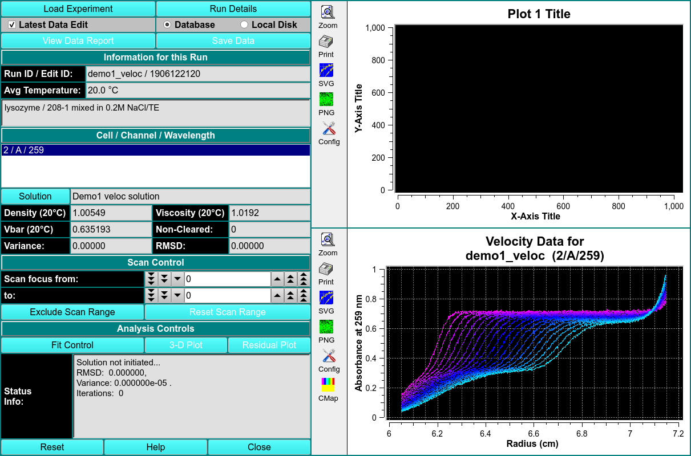
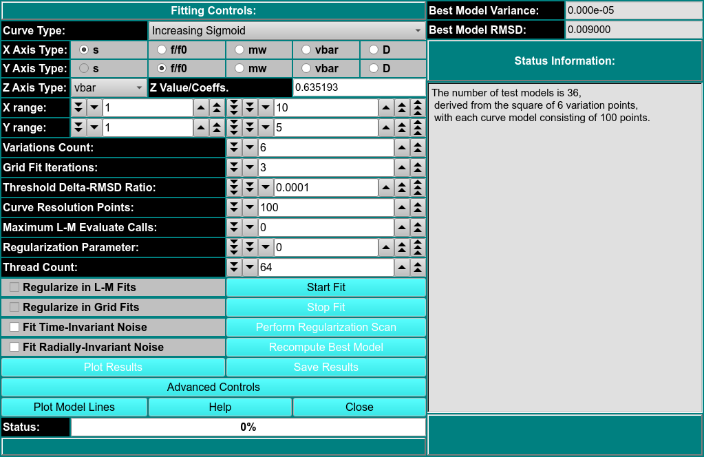

# Parametrically Constrained Spectrum Analysis

MS: &#x2717;
 
BD: &#x2717;

!!! danger ""

    
    
This module enables you to perform parametrically constrained spectrum analysis on a chosen experimental data set. Upon completion of an analysis fit, plots available include: model lines; experiment; simulation; overlayed experiment and simulation; residuals; time-invariant noise; radially-invariant noise; 3-d model. Final outputs may include a model and computed noises. 

The PCSA method is used for composition analysis of sedimentation velocity experiments. It can generate sedimentation coefficient, diffusion coefficient, frictional coefficient, f/f0 ratio, and molecular weight distributions. The distributions can be plotted as 3-dimensional plots (2 parameters from the above list against each other), with the third dimension representing the concentration of the solute found in the composition analysis. The set of all such final calculated solutes form a model which is used to generate a simulation via Lamm equations. The simulation is plotted overlaying a plot of experimental data. 

The PCSA pass proceeds for a set of models each of which consists of the solute points along a curve in s,f/f0 space. The model whose RMSD of the resulting residuals (simulation-experimental difference) is the lowest forms the starting point for a second phase which uses Levenberg-Marquardt to refine the model to a final output model. The set of initial curves is specified by a s and f/f0 ranges and a direct or implied number of variations in f/f0 end-points or sigmoid par1, par2 values.

Solution

Scan Exclusion Profile

Analysis Controls

3D Plot
    
 Residual Plot
    
Fit Control 

Status Info This dialog will provide information on the initatization of the solution, the RMSD, the variance, and number of iterations performed so far.
    
??? quote "PCSA Fit Control Dialog"

    !!! danger ""

        
    
        The parameters of this dialog define and control an analysis run to find the set of solutes that best fits experimental data. 
    
        Each analysis run proceeds over a defined set of curves in s and f/f0 space. The single analysis pass produces the model whose associated simulation differs the least from the experimental data, as determined by its RMSD value. Time-invariant and/or radially-invariant noise(s) may also be computed. The curves in a set cover a specified s and f/f0 range and vary according to a specified increment or count. Each model has a specified number of input solute points along its curve. 

        After an initial pass in which all the specified model curves are evaluated, the results are sorted by fitness (least RMSD). The best model then becomes the starting point for a second pass that utilizes Levenberg-Marquardt to refine the model. The result of that second pass is inserted as the final best model. 
    
        Variations Count Specify the number of curve variations in each direction to form the model. Usually, the square of this number is the number of models to analyze. 
    
        Grid Fit Iterations Specify the number of iterations of fixed grid fits to perform. Each iteration after the first starts with a range of par1 and par2 values of f/f0 values that is refined from the best models of the previous iteration.
    
        Threshold Delta-RMSD Ratio Specify the ratio of the delta in RMSD to previous iteration RMSD that is the threshold below which the iterative scan is taken to have converged.
    
        Curve Resolution Points Specify the number of points to generate for each test time. This is the number of solute points that each model will have.
    
        Maximum L-M Evaluate Calls Specify the maximum number of Levenberg-Marquardt (L-M) evaluate cells to allow. The default of 100 is almost always sufficient. This value is used to insure that a run-away condition will not occur. Additionally, a value of 0 may be specified to suppress L-M and use the final fixed grid best model as the overall best model.
    
        Regularize in L-M Fits This box should normally remain unchecked, but you may check it to test regularization during the L-M stage of model fitting.
    
        Regularize in Grid Fits
    
        Thread Count Define the number of threads that is appropriate to the complexity of the run and the number of processors or cores avaliable. 
    
        Fit Time-Invariant Noise Check this box if you want to calculate time-invariant noise.
    
        Fit Radially-Invariant Noise Check this box if you want to calculate radially-invariant noise.
    
        Perform Regularization Scan Once fit analysis is complete, you may optionally click here to bring up a dialog that will set the best value for the Regularization Parameter.
    
        Recompute Best Model
    
        Advanced Controls
    
        Plot Model Lines Click this button to open a dialog showing the Model Lines. 
    
        Best Model Variance The minimum value for models thus computed. This value is continually updated.
    
        Best Model RMSD The minimum RMSD value for models thus computed. This value is continually updated. Note that at completion of all model computations, this box and the Best Model Variance box will hold values of the final best model, which might not be the minimum.
