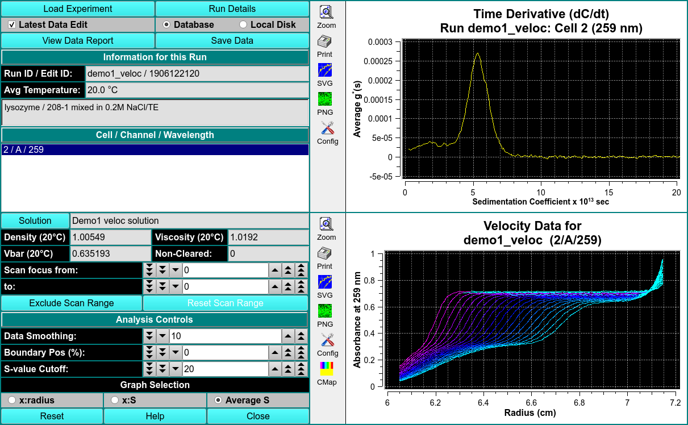

# Time Derivative

MS: &#x2717;
 
BD: &#x2717;

This module will calculte g(s) differential sedimentation profiles by subtracting consectutive scan pairs from each other and mapping the resulting difference curves to the S domain to obtain dc/dt curves. 

The advantage of this method is its ability to nicely subtract out time invariant noise. Unlike the [van Holde-Weischet module](velocity-evhw), the Time Derivative method does not correct for diffusion. In order to obtain accurate results, it is important to use only a small scan range over which diffusion has not change significantly.

!!! danger ""

    
    
    Time Derivative (dC/dt). Average g*(s) vs. Sedimentation Coefficient (Svedberg)
    
    Velocity Data. Intensity at Wavelength (nm) vs. Radius (cm)
 
Analysis Controls

Data Smoothing Choose the number of points to use for any smoothing of raw input data. 

Boundary Pos. (%) Choose the percent of the plateau-baseline range that is to be added to the baseline to form the beginning of analysis span. 

S-value Cutoff Choose the sedimentation coefficient value to form the maximum X value of the Time Derivative plot. 

Graph Selection

x:radius Select this radio button to choose a g*(S) versus radius dC/dt plot. 

x:S Select this radio button to choose a g*(S) versus sedimentation coefficient dC/dt plot. 

Average S Select this radio button to choose an Average g*(S) versus sedimentation coefficient dC/dt plot. 